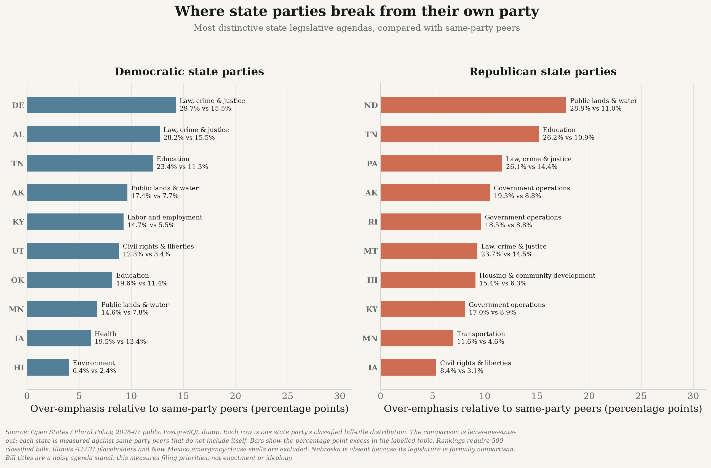
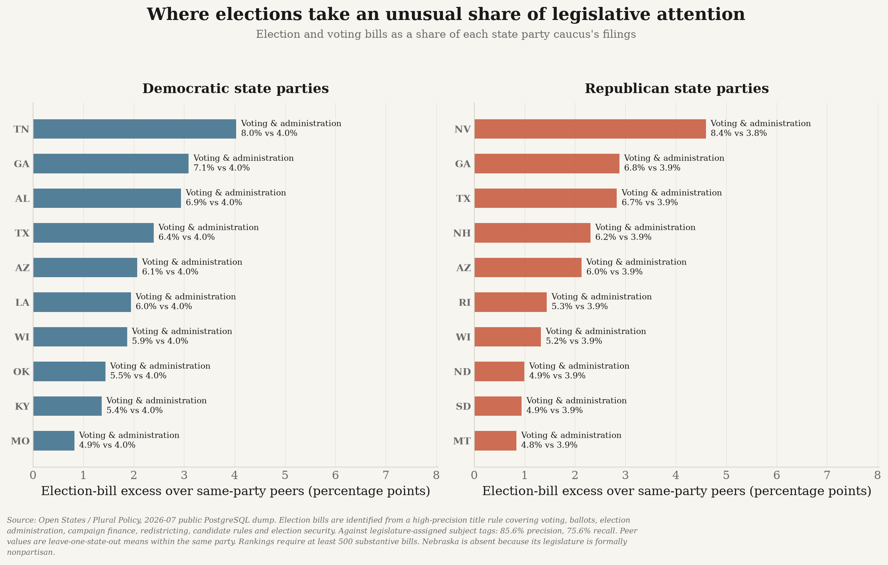

# state-politics

**What are the 50 state Democratic and Republican party organizations actually emphasizing?**

This project measures the policy priorities of all 100 U.S. state-level party organizations
(50 states × 2 parties) from two complementary evidence streams, classified into one shared
taxonomy so they can be compared directly.

| Stream | What it captures | Actor | Source |
|---|---|---|---|
| **A. Platforms** | *Stated* priorities — what the party organization says it wants | State party committee | Harvard Dataverse (1846–2017) + original collection (2018–present) |
| **B. State bills** | *Revealed* priorities — what the party's legislators actually file | Party caucus in the legislature | Open States / Plural Policy |

Congressional bills are **out of scope**. This is about *state* politics.

📄 **[Full methodology →](docs/METHODS.md)**  ·
📐 **[Analytical scope →](docs/ANALYSIS_DEPTH.md)**  ·
🔍 **[Reproducibility audit →](docs/REPRODUCIBILITY.md)**  ·
🧭 **[Code guide →](docs/CODE_GUIDE.md)**  ·
📋 **[Roadmap and lessons →](docs/PLAN.md)**  ·
📚 **[Citations →](CITATIONS.md)**

---

## Data

- **Stated priorities:** 249 confirmed party-committee documents in the modern collection:
  233 dated 2018+ across 80 organizations and 16 older fallback documents. A separately labelled
  four-source legislative-caucus supplement fills four otherwise missing state-party rows. The
  platform-vs-bill analysis uses only 2018+ party-committee evidence.
- **Revealed priorities:** 1,087,327 state legislative bills and 5,000,761 sponsorship records.
- **Historical comparison:** 2,091 state party platform documents covering 1840–2017.
- **State profiles:** 100 state × party rows, with stated evidence where available and partisan
  bill evidence for every state except Nebraska's formally nonpartisan legislature.

Collection, missing-source verification, OCR reconstruction and coverage accounting are
documented in [Methods](docs/METHODS.md) and
[Reproducibility](docs/REPRODUCIBILITY.md).

---

## What the parties say

Every 2018-present platform, and every major-party platform from 1990 onward, is segmented
into planks and classified against a
[Comparative Agendas Project](https://www.comparativeagendas.net/) taxonomy using a validated
text classifier — 41,030 planks from 898 documents.


Democratic platforms devote more space to labour, environment, health and social welfare;
Republican platforms to public lands, government operations, taxation, culture and family
questions, and law and crime.

---

## The headline result: what they say vs. what they file


**Both parties talk far more about rights and identity than they legislate, and legislate far
more about crime, transportation and education than they talk about.**

Every row was re-derived a second time using topic labels written by **legislative staff**
instead of by this project's model. That independent check is the third column.

| Topic | D said → filed | R said → filed | Replicates? |
|---|---|---|---|
| Civil rights and liberties | 10.9% → **3.0%** | 11.9% → **2.8%** | ✅ gap is *larger* (1.5% / 0.7%) |
| Immigration | 4.6% → **0.9%** | 5.6% → **0.9%** | ✅ gap is *larger* (0.3% / 0.2%) |
| Culture, family, social issues | 2.4% → **1.8%** | 5.1% → **1.5%** | ✅ R only (2.6% / 2.4%) |
| Law, crime and justice | 9.4% → **13.8%** | 9.6% → **15.5%** | ✅ (13.8% / 13.5%) |
| Transportation | 2.2% → **4.7%** | 1.1% → **5.2%** | ✅ gap is *larger* (7.0% / 9.7%) |
| Education | 8.9% → **10.3%** | 8.4% → **12.2%** | ✅ gap is *larger* (14.3% / 19.5%) |
| ~~Housing and community development~~ | ~~4.4% → 9.4%~~ | ~~2.3% → 6.0%~~ | ❌ **does not replicate** (3.0% / 0.9%) |

The topics that dominate platform rhetoric are largely *national* fights that state legislatures
have limited power over; the topics that dominate actual filing are the bread-and-butter business
of state government. Immigration is the sharpest case — Republican platforms give it 5.6% of
their planks and Republican legislators 0.9% of their bills.

**The housing row does not survive the check and should not be believed.** The classifier reads
a property-tax bill by the thing being taxed rather than by the tax, so "authorize a property tax
freeze for owner-occupied homes" lands in housing. It is struck through rather than quietly
deleted, because a corrected claim is more useful than a tidy one. Rows marked † in the figure
are flagged for the same reason.

### How the claims were checked

Roughly half of all bills carry `subject` tags applied by the legislature's own staff — an
independent labelling that owes nothing to this project's model.
[181 unambiguous tags](conf/subject_topic_map.yml) are mapped onto the same taxonomy and used
both to score the classifier and to re-derive the headline outright.

| Check | Result |
|---|---|
| Plank classifier vs. hand-labelled gold set | 62% top-1, 78% top-2 |
| Bill-title classifier vs. statehouse tags | **63.2%** agreement on 46,659 bills, 35 states |
| Headline re-derived from tags, not the model | **33 of 40 rows hold** (111,521 bills) |

The consequential failure is taxation: Macroeconomics recall is 18.1%, so tax bills scatter
into whatever was being taxed — inflating housing and public lands. Several other failed rows
change sign by only a fraction of a point and should be treated as noise. Full precision/recall
breakdown is in [the methods](docs/METHODS.md#validating-the-bill-classifier).

**Other limits.** Bills are classified from *titles*, which are short and often procedural.
18.9% of bills cannot be resolved to a party and are excluded rather than guessed at. Planks
below a similarity threshold are recorded as **unclassified** rather than pushed into the nearest
topic — 3,733 of 41,030. And filing a bill is not passing one: this measures **agenda, not
achievement**.

---

## Do the parties hold together? Intra-party comparison

Every figure above treats each party as one actor. With 50 state organizations per party, that
assumption can be tested rather than assumed.

```bash
uv run python -m state_politics.analysis.intraparty
uv run python scripts/plot_intraparty.py
```


The party label provides only a modest similarity advantage. For platforms, same-party state
organizations are **72.9% similar** in topic mix versus **68.2%** for opposite-party pairs—a
4.7-point difference. For bills, the comparison is **88.9% versus 87.0%**, only 2.0 points.

**This measures agenda overlap, not agreement.** Every vector is a distribution over *topics*,
so two organizations are "close" when they devote similar attention to the same subjects — not
when they want the same things. A Democratic and a Republican platform that each spend 10% of
their planks on abortion are adjacent on this measure while advocating opposite policies. The
finding is about what parties put on the agenda, not about ideology.

**Republican state parties disagree with each other more than Democratic ones do — but only in
what they say.** Republican platforms are markedly more scattered (mean pairwise distance 0.319
vs 0.223), and a permutation test that shuffles the party labels across the same 18 states puts
that outside chance (p = 0.026). The same comparison on bills runs the other way and is *not*
significant (0.121 vs 0.100, p = 0.30), so it is reported as a null result.

That contrast is the interesting part: Republican state committees write more varied platforms
than Democratic ones, while their legislators file strikingly similar bills.

What state parties *do* disagree about differs by party:

| | Most divisive topics within the party (cross-state SD of topic share) |
|---|---|
| **Democratic platforms** | Public lands and water (7.1pp), Agriculture (4.9pp), Law and crime (4.8pp) |
| **Republican platforms** | Government operations (10.4pp), Civil rights (8.2pp), Law and crime (7.6pp) |
| **Democratic bills** | Law and crime (5.7pp), Public lands (4.0pp), Education (3.8pp) |
| **Republican bills** | Public lands (4.2pp), Law and crime (4.1pp), Government operations (3.5pp) |

Public lands is the clearest case of geography beating party: it is a top-three source of
internal disagreement in three of the four party-stream comparisons, and ranks fourth for
Republican platforms. A Nevada party of either stripe has a public-lands agenda and a Rhode
Island one does not.

Dispersion is only ever compared between parties over the **same set of states**, since a party
whose surviving platforms come from more unusual states would otherwise look more divided for
purely compositional reasons. That restriction is what limits the platform comparison to 18
states.

These are comparison samples, not data-coverage counts. The project has stated state-level
evidence for all 50 states, but this matched platform comparison requires **both parties in the
same state** to have at least 30 classified current planks, leaving 18 states. Bills cover all
50 states, but Nebraska has no D/R caucus comparison because its legislature is formally
nonpartisan, leaving 49.

---

## Which states stand out within their own party?

The national averages hide large state differences. `state_party_focus.csv` contains one row
for every state × party pair, comparing each state with **other states of the same party**.
The bill side covers 98 partisan caucuses across 49 states; Nebraska is explicitly unavailable
because its legislature is formally nonpartisan.



Representative departures:

| State party | Disproportionate bill focus | State share | Same-party peers |
|---|---|---:|---:|
| Idaho Democrats | Civil rights and liberties | 22.5% | 3.9% |
| New Mexico Democrats | Social welfare | 19.7% | 3.7% |
| North Dakota Democrats | Public lands and water | 23.0% | 8.1% |
| Illinois Republicans | Science and technology | 14.0% | 1.8% |
| North Dakota Republicans | Public lands and water | 28.8% | 10.9% |
| Alaska Republicans | Government operations | 19.3% | 9.3% |

The baseline is leave-one-state-out, so Idaho does not help define the Democratic average it is
measured against. The full atlas also includes stated-agenda topics, evidence type, sample size,
cosine distance and distinctive language.

### Elections and voting

Election policy is hidden inside the broad Government Operations taxonomy, so it is measured
separately from titles covering voting, ballots, election administration, campaign finance,
redistricting, candidate rules and election security.



- Republican caucuses devote **3.43%** of substantive bills to elections and voting; Democrats
  **3.05%**.
- Tennessee Democrats are the strongest Democratic outlier among caucuses with at least 500
  substantive bills: **8.0%** versus 4.0% among Democratic peers.
- Nevada Republicans lead their side: **8.4%** versus 3.8% among Republican peers.
- The title rule scores **85.6% precision and 75.6% recall** against legislature-assigned
  subject tags.
- Most detected bills concern voting and election administration; campaign finance,
  redistricting, candidate rules and election security form smaller subgroups.

### Distinctive language: TF-IDF and log₂ concentration

`state_party_terms.csv` reports both TF-IDF and a same-party concentration score for words and
two-word phrases. A log₂ score of +1 means a term is twice as concentrated as in peer states;
+2 means four times. Examples:

| State party and stream | Distinctive language |
|---|---|
| Alaska Democrats, stated | `salmon` (+7.9), `fisheries` (+5.4) |
| Kentucky Republican caucus supplement (8 items; descriptive) | `postsecondary` (absent in peers), `sick leave` (+10.5) |
| New Jersey Republican caucus supplement (21 items; descriptive) | `school funding` (+8.9), `property taxes` (+5.8) |
| South Dakota Democrats, stated | `tribal colleges` (+5.0), `high tech` (+8.5) |
| Alaska Democrats, bills | `permanent fund` (+12.0) |
| Arkansas Republicans, bills | `child maltreatment` (+7.2) |

These are exploratory language signals, not topic labels. A numeric value is reported only when
same-party peers also use the phrase; a phrase used by no peers is labelled `absent in peers`
rather than assigned an arbitrary pseudo-ratio. Legislative drafting conventions and proper
names can also become state-specific; the public highlights filter common procedural
boilerplate, while the raw scores remain available for inspection.

---

## Model legislation

Advocacy groups circulate template bills, and near-identical text surfacing in a dozen capitols
is visible in the data: **187 clusters spanning 3+ states, 2,027 bills, the widest reaching 19.**

| States | Bills | Cohesion | Template |
|---|---|---|---|
| 19 | 37 | 0.57 | Audiology and speech-language pathology interstate compact |
| 12 | 81 | 0.54 | Agreement Among the States to Elect the President by National Popular Vote |
| 9 | 18 | 0.62 | Uniform Civil Remedies for Unauthorized Disclosure of Intimate Images |
| 6 | 38 | 0.36 | Applying for an Article V convention to amend the U.S. Constitution |
| 6 | 26 | 0.50 | Forming Open and Robust University Minds (FORUM) Act |

This shows **text reuse, not coordination**, and the state counts are an upper bound — clusters
are connected components, so `cohesion` (the lowest pairwise similarity inside a cluster) is
reported alongside. Ceremonial resolutions circulate just as widely and are flagged separately
(65 of 187).

---

## Data sources

All fetched and verified live; full citations, crediting the *collecting* organizations, are in
[`CITATIONS.md`](CITATIONS.md).

| Source | Role | Scale |
|---|---|---|
| Hopkins, Coffey, Galvin, Gamm, Henderson, Paddock & Schickler — *Select American State Party Platforms* (Harvard Dataverse, CC0) | Historical platforms | 2,091 docs, 49 states, 1840–2017 |
| Open States / Plural Policy — bulk data | Bills, sponsors, legislators | 1,087,327 bills, 50 states, sessions overlapping 2018–2026 |
| Internet Archive + official document hosts | Discovery of 2018–present platforms/resolutions | 236 Wayback, 8 live, 5 official hosted copies |
| Official state legislative caucus sites | Separately labelled agenda supplement | 4 sources completing stated state-level coverage to 50/50 |
| Wikidata + hand verification | Registry of official party websites | 100/100 resolved |

---

## Core principles

1. **No fabricated or interpolated data.** Every document and bill traces to a fetched URL with an
   HTTP status, timestamp and SHA-256. If a party published nothing, that is **omitted** — never
   imputed, never smoothed.
2. **Absence is a finding.** Every gap carries a directly-probed reason. The gap report is a
   deliverable.
3. **Validate before interpreting.** Classifier results are checked against hand-labelled
   platform planks and independently assigned legislative subject tags.
4. **Cite the collector, not the redistributor.**
5. **Reproducible from source.** Nothing in `data/` is committed except the hand-labelled
   validation set, which is authored input rather than a derived artifact.

---

## Reproduce

Requires Python 3.11+ and [uv](https://docs.astral.sh/uv/).

```bash
make setup      # install dependencies
make all        # analysis + figures
make test lint audit  # tests, lint, traceability and published-number checks
```

Network-heavy stages are deliberately **not** part of `make all`, so rebuilding the analysis never
re-crawls anyone's website:

```bash
make registry     # verify all 100 state party websites          (~10 min)
make platforms    # discover + collect 2018-present platforms    (~1 h, polite crawl)
make official-documents  # deterministically rebuild OCR-only party documents
make caucus-priorities  # collect the four separate caucus agenda sources
make bills-dump   # download the 10.7 GB dump, extract, delete it (~20 min)
```

Every canonical number in this README can be reprinted from the artifacts:

```bash
uv run python scripts/report_figures.py
```

`make audit` verifies every manual-input hash, source registry, random seed, OCR version,
generated-artifact producer, 50-state coverage invariant, focus-atlas row, election
numerator/denominator, and log₂ calculation. It writes
`data/processed/reproducibility_report.json`.

---

## Layout

```
state-politics/
├── conf/                        # taxonomy, party registry, gap findings, tag map
├── data/gold/                   # hand-labelled validation set (authored input)
├── docs/                        # METHODS.md, PLAN.md
├── src/state_politics/
│   ├── provenance.py            # url, http_status, sha256, retrieved_at, source_org
│   ├── compute.py               # model runtime and reproducibility helpers
│   ├── platforms/               # stream A: collection + extraction
│   ├── bills/                   # stream B: Open States ingest + sponsor party join
│   ├── analysis/                # taxonomy, emphasis, divergence, diffusion, validation
│   └── plotting/                # shared portfolio chart theme
├── outputs/                     # figures
└── tests/
```

Every network fetch goes through `state_politics.provenance`, which writes an append-only JSONL
log of URL, HTTP status, SHA-256, byte count, content type, timestamp and collecting organization.
`fetch()` deliberately **does not raise** on HTTP errors — a 404 is a legitimate research finding,
recorded rather than thrown away.
