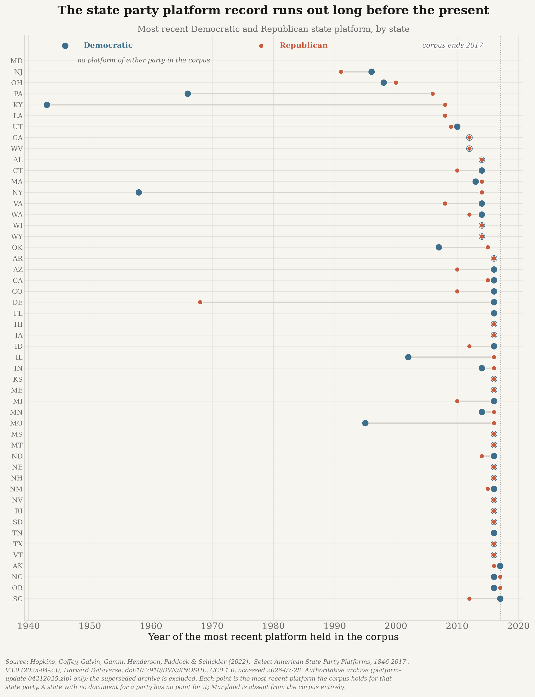

# state-politics

**What are the 50 state Democratic and Republican party organizations actually emphasizing?**

This project measures the policy priorities of all 100 U.S. state-level party organizations
(50 states × 2 parties) using two complementary evidence streams:

| Stream | What it captures | Actor | Source |
|---|---|---|---|
| **A. Platforms / manifestos** | *Stated* priorities — what the party organization says it wants | State party committee | Harvard Dataverse corpus (1846–2017) + original collection (2018–present) |
| **B. State legislative bills** | *Revealed* priorities — what the party's legislators actually file | Party caucus in the state legislature | Open States / Plural Policy |

Congressional bills are **out of scope**. This is about *state* politics.

---

## Why this project exists

There is no ready-made dataset answering this question for the present day.

The best existing platform corpus — *Select American State Party Platforms, 1846–2017*
(Harvard Dataverse, `doi:10.7910/DVN/KNOSHL`) — is excellent but **stops at 2017**. We verified this by
downloading it and enumerating every file: **2,091 platform documents**, 2,086 unique
`(state, party, year)` observations, **49 states plus national platforms**, **maximum year 2017**.
Coverage is also very uneven (**Maryland is absent entirely**; Kentucky Democrats last appear in
**1943**; New York Democrats in **1958**; Florida Republicans not at all).

> The dataset ships two archives. `platform-update-04212025.zip` **supersedes** `05 for public.zip`;
> the included changelog reconciles exactly (49 files added, 21 removed). Naively unioning the two
> archives inflates the corpus to 4,154 "documents" by resurrecting files the authors deliberately
> deleted and double-counting the rest. This project uses the update archive as authoritative.

So **the 2018–present platform corpus does not exist and this project builds it**, from official state
party websites and the Internet Archive.

The bills side, by contrast, is well served: Open States publishes free, public, current bulk data for
all 50 states.

---

## Core principles

1. **No fabricated or interpolated data.** Every platform document and every bill row traces to a fetched
   URL with an HTTP status, retrieval timestamp, and SHA-256 content hash. If a state party published no
   platform in a cycle, that observation is **omitted** — never imputed, never smoothed, never guessed.
2. **Absence is a finding.** "The Ohio Republican Party has published no platform since 2000" is a
   legitimate research result, not a pipeline bug. The gap report is a deliverable.
3. **No hosted LLM APIs. Models run locally.** Every model this project runs — embeddings, classifiers,
   topic models — runs on this machine's Apple Silicon GPU (M4, 16 GB unified memory) via Metal
   Performance Shaders, falling back to CPU. This is enforced in code, not just documented: a test
   scans the entire source tree for hosted-provider imports and inference endpoints and fails the
   build if any appear. See [`src/state_politics/compute.py`](src/state_politics/compute.py).
   The reason is reproducibility — a hosted model is an unversioned dependency, and a result that
   cannot be regenerated from pinned local weights is not reproducible research.
4. **Cite the collector, not the redistributor.** Citations name the organization or authors who
   *collected* the data, not merely the API that served it. See [`CITATIONS.md`](CITATIONS.md).
5. **Reproducible from source.** Nothing in `data/` is committed. Everything is rebuildable by running
   the pipeline.

---

## Data sources

All sources were fetched and verified live on **2026-07-28**. Full bibliographic citations, with the
collecting organizations credited, are in [`CITATIONS.md`](CITATIONS.md).

| # | Source | Role | Verified |
|---|---|---|---|
| 1 | Hopkins, Coffey, Galvin, Gamm, Henderson, Paddock & Schickler — *Select American State Party Platforms, 1846–2017* (Harvard Dataverse, CC0) | Historical platforms | 2,091 docs, 49 states, 1840–2017 |
| 2 | Open States / Plural Policy — bulk data | State bills, votes, legislators (all 50 states, current) | 2026-07 public dump, 10.7 GB |
| 3 | Open States API v3 | Targeted bill/sponsorship refresh | `Bill.sponsorships`, `Person.party` |
| 4 | Internet Archive — Wayback CDX Server API | Discovery of 2018–present platform documents | Returned real platform docs |
| 5 | Wikidata | Registry of official state party websites | 50/50 Democratic; Republican needs extra work |

---

## Project status

Greenfield. Work is organized in phases:

| Phase | Description | Status |
|---|---|---|
| 0 | Scaffolding + provenance layer | ✅ done |
| 1 | Ingest historical platform corpus (1846–2017) | ✅ done |
| 2 | Build verified registry of all 100 state party organizations | ✅ done |
| 3 | Collect 2018–present platforms (the hard part) | ✅ done |
| 4 | Build 50-state bill + sponsor-party pipeline | 🚧 legislators done; bills **blocked** |
| 5 | Define a shared issue taxonomy for both streams | ✅ done |
| 6 | Compute emphasis scores and stated-vs-revealed divergence | 🚧 platform emphasis done |
| 7 | Outputs, per-state profiles, reproducible build | ⬜ |

Full roadmap, including the source-verification work behind it, is in [`docs/PLAN.md`](docs/PLAN.md).

### Stream B: legislators and bills

`state_politics.bills.people` ingests the current legislators for all 50 states from Open
States' **public, no-auth** per-state CSVs. This is the join key for the whole bills stream —
a bill records who sponsored it, and this records which party that sponsor belongs to.

```bash
uv run python -m state_politics.bills.people
```

**Result: 7,359 currently-serving legislators across all 50 states** — 4,000 Republican,
3,166 Democratic, 193 other. Chambers: 5,389 lower, 1,921 upper, 49 `legislature` (Nebraska's
nonpartisan unicameral). Third parties and independents are deliberately kept as `other`
rather than folded into the major two, since misfiling them would misattribute their bills.

> **Bills themselves are currently blocked, and it is worth being precise about why.**
> Open States offers three routes and none is usable here as-is:
> * the per-session CSV/JSON archives are **login-gated** (verified: every path under
>   `data.openstates.org/csv/` and `/json/` returns HTTP 403);
> * the complete public PostgreSQL dump is **10.7 GB**, and this machine has 32 GB free with
>   no PostgreSQL installed — the dump plus a restore does not fit;
> * the API v3 needs a free key (`OPENSTATES_API_KEY`, see `.env.example`).
>
> The API route is the practical one. `provenance.download_to_file()` already streams to disk
> with incremental hashing for the dump route if the space and a database become available.

---

## What the parties actually emphasize

With both platform corpora in hand, `state_politics.analysis` segments every document into
planks, classifies each against a shared issue taxonomy, and measures **share of planks** —
share rather than count, because platforms differ by an order of magnitude in length and raw
counts would measure verbosity rather than priority.

```bash
uv run python -m state_politics.analysis.validate   # score the classifiers first
uv run python -m state_politics.analysis.emphasis
uv run python scripts/plot_party_emphasis.py
```

The taxonomy (`conf/topics.yml`) is anchored to the **Comparative Agendas Project** major topic
codes rather than invented here, so results are comparable with the wider literature and so the
Open States `subject` tags can be mapped onto the same scheme when the bills stream unblocks.

Classification runs **locally on the M4 via MPS** — a pinned sentence-transformer embeds each
plank and each topic description and assigns the nearest topic. A transparent keyword baseline
runs alongside it, not as a fallback but so the model's output can be checked against something
a human can read and argue with.

**Validation, on 43,104 planks from 872 documents:**

| Classifier | Top-1 | Top-2 |
|---|---|---|
| Keyword baseline | 56% | — |
| Embedding (MPS) | **62%** | **78%** |

Scored against `data/gold/plank_topics_gold.csv` — 50 planks drawn at random (seed 20260729)
and hand-labelled by the author. It is small and single-annotator, so it supports claims about
broad aggregate emphasis and not about any individual plank; some planks are genuinely ambiguous
between two defensible topics, which is why top-2 is reported alongside top-1. Chance on this
21-way task is about 5%.


Democratic state parties devote more of their platforms to labour, the environment, housing,
health and social welfare; Republican state parties to government operations, public lands,
taxation, culture and family questions, and law and crime. Planks below a similarity threshold
are recorded as **unclassified** and excluded from the denominator rather than pushed into
whichever topic was least far away — 3,051 of the 43,104 planks fall there.

---

## Reproduce what exists so far

```bash
# Download the Dataverse corpus, verify it against its own changelog, and build the
# document table + per-state coverage matrix. Idempotent; records provenance for every file.
uv run python -m state_politics.platforms.dataverse

# Render the coverage figure that motivates the project.
uv run python scripts/plot_platform_coverage.py

# Build the registry of all 100 state party organizations and check every homepage.
# Takes several minutes: it contacts 100 live sites.
uv run python -m state_politics.platforms.registry

# Find 2018-present platform documents (Wayback CDX + one homepage scan per site), then
# fetch, extract and confirm them. Both are slow and deliberately polite; --resume re-tries
# only fetches that failed.
uv run python -m state_politics.platforms.discover
uv run python -m state_politics.platforms.collect --resume
uv run python scripts/plot_platform_gap.py

# Stream B: all 50 states' current legislators (public, no API key needed).
uv run python -m state_politics.bills.people

# Classify planks and measure emphasis (local model on Apple Silicon; no API key).
uv run python -m state_politics.analysis.validate
uv run python -m state_politics.analysis.emphasis
uv run python scripts/plot_party_emphasis.py
```

The ingest prints a reconciliation line that must read `changelog consistent` before it will
write anything:

```
changelog consistent: authoritative=2091 superseded=2063 added 49/49 confirmed, deleted 21/21 confirmed, revised_in_place=47
documents:            2091
major-party docs:     1975 (D=1066, R=909)
year range:           1840-2017
states with no major-party platform at all: ['MD']
```

Outputs: `data/processed/platforms_historical.parquet`,
`data/processed/platforms_historical_coverage.csv`, `conf/party_registry.yml`,
`data/provenance.jsonl`, and `outputs/platform_corpus_recency.png`.



### What the registry build found

`conf/party_registry.yml` holds all 100 organizations, each with a `source_url`,
`verified_on` date, the HTTP status observed for its homepage, and a `needs_review` flag.
A row is only trusted when the **visible page text** identifies that state's party. That bar
is deliberately high, and it had to be raised twice:

* Wikidata's URL for the **Michigan Republican Party** (`migop.org`) now redirects to
  `kiss918menang.com`, and the **Nebraska Republican Party**'s (`negop.org`) to
  `wildarms4.com` — both unrelated commercial sites.
* **South Dakota**'s (`southdakotagop.com`) now serves a law-firm directory, and
  **Arizona**'s (`az.gop`) redirects to an image file on a public radio station's server.
* Four more (`ctgop.org`, `indgop.org`, `rigop.org`, `wsrp.org`) no longer resolve at all.
* Six state Republican parties have rebranded onto `.gop` domains (Colorado, Delaware,
  Illinois, Missouri, South Carolina, Virginia); the registry records the destination directly
  rather than depending on a redirect that could later be repointed.

A first version of the content check matched raw HTML, which let a page confirm itself: the
Alaska Republican Party's `alaskagop.org` serves an **`Account Suspended`** page whose only
occurrences of "alaska" and "gop" are inside `webmaster@alaskagop.org`, and it was recorded as
verified. Matching now runs on visible text with URLs, e-mails and domain tokens stripped,
rejects parked/suspended pages, and requires a page to name its *own* party more often than the
other one (Republican sites mention "democrat" constantly).

Nineteen hand-checked corrections are recorded in `MANUAL_OVERRIDES`, each carrying the evidence
that established it. Current state: **100/100 websites resolved, 92/100 machine-verified**. The
remaining eight sit behind bot protection (HTTP 403) or render their content in JavaScript — plus
Alaska's Republican site, which is genuinely suspended. They stay flagged for human confirmation
rather than being asserted as correct.

A redirect is never allowed to change the crawl target: `website` keeps the configured URL and
the observed destination is recorded separately in `final_url`, with an off-domain redirect
forcing human review.

### The 2018–present corpus this project built

This is the part that did not previously exist. Discovery queried the Wayback CDX index for
every party domain and scanned each live homepage once, producing **2,975 candidate URLs**
(1,474 scoring as likely documents). Collection then fetched them, extracted the text, and
confirmed each against its own content.

**Result: 200 confirmed documents across 78 of the 100 organizations and 45 states** —
105 Democratic, 95 Republican, 1.25 million words, median ~3,500 words per document. By type:
mostly platforms, plus resolution sets, legislative-priority agendas and statements of
principles. Most are dated 2018 or later; a handful of pre-2018 documents also fill holes in
the Dataverse corpus.


`data/processed/platform_gap_report.csv` gives every organization an explicit status, because
"no platform found" has to be explainable rather than asserted:

| Status | Count | Meaning |
|---|---|---|
| `found` | 78 | at least one confirmed document |
| `candidates_rejected` | 9 | documents were fetched but none read as a platform |
| `no_strong_candidates` | 7 | only weak URL matches existed |
| `no_candidates` | 6 | nothing matched in the archive or on the site |

**Known limitation:** most of the 22 remaining gaps are JavaScript-rendered or bot-protected
sites. Louisiana Republicans' resolution pages yield 322–520 characters of static text because
the content is assembled in the browser, and several hosts return HTTP 403 to any scripted
request. Static fetching cannot see those, and the pipeline records that rather than guessing.

When the archived snapshot is thin, collection now falls back to the live URL and keeps
whichever copy carries more text — the Massachusetts Democrats' platform page yields 1,743
characters from the capture the archive happened to take and 94,756 live.

---

## Setup

Requires Python 3.11+ and Apple Silicon (for local GPU inference). Uses
[uv](https://docs.astral.sh/uv/).

```bash
uv sync --extra dev                  # create .venv and install dependencies
uv sync --extra dev --extra models   # add local-only model stack (torch + MPS)
uv run pytest                        # run the test suite
uv run ruff check .                  # lint
```

The `models` extra installs **torch, sentence-transformers and scikit-learn** — all of which run
locally. No API keys are required by this project, and none should ever be added.

---

## Layout

```
state-politics/
├── CITATIONS.md                 # bibliographic citations, collector-first
├── conf/
│   └── party_registry.yml       # 100 state party orgs: state, party, domain, source_url, verified_on
├── src/state_politics/
│   ├── provenance.py            # url, http_status, sha256, retrieved_at, source_org
│   ├── compute.py               # local device selection + hosted-LLM guard
│   ├── plotting/                # shared portfolio chart theme
│   ├── platforms/               # stream A: manifesto collection + extraction
│   ├── bills/                   # stream B: Open States ingest + sponsor party join
│   └── analysis/                # topics, emphasis, diffusion
├── data/                        # gitignored; fully reproducible from code
└── tests/
```

## Provenance

Every network fetch in this project goes through `state_politics.provenance`, which writes an
append-only JSONL log recording the URL, HTTP status, SHA-256 of the body, byte count, content type,
UTC retrieval timestamp, and the organization that collected the data. That log is what makes the
"no fabricated data" principle checkable rather than aspirational.

Notably, `fetch()` **does not raise on HTTP errors**. A 404 is a legitimate research finding — the
state party published no platform — so it is recorded with `ok=False` rather than thrown away.

## Figures

Figures use the shared portfolio theme in `state_politics.plotting`, matched to
`congressional_record` and `pre1870_reapportionment_package`: cream `#F7F5F0` background, serif
type, muted grid, tickless axes, borderless legend, bold title with a muted subtitle, italic source
note, direct end-of-line series labels, saved at `dpi=200` with `bbox_inches="tight"`. Democratic
series use the muted blue `#3D6F8C`, Republican series the terracotta `#C85A3D`. The palette is
pinned by tests so it cannot drift away from the other repos.
