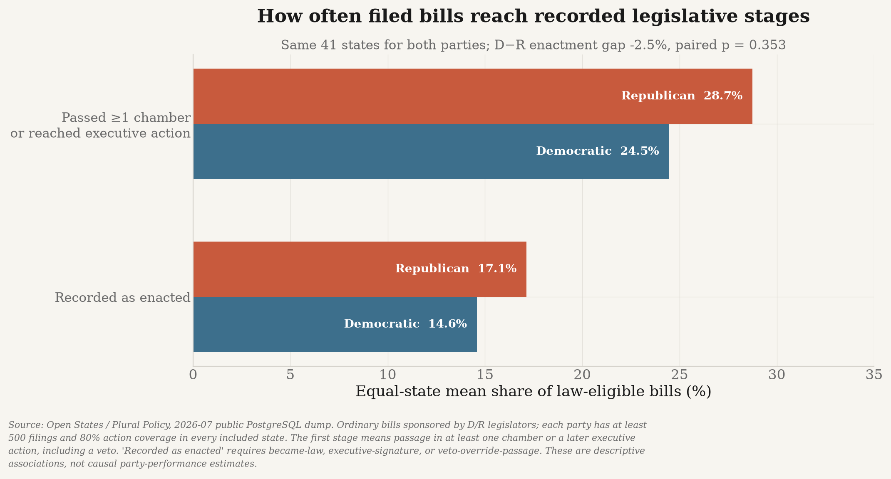
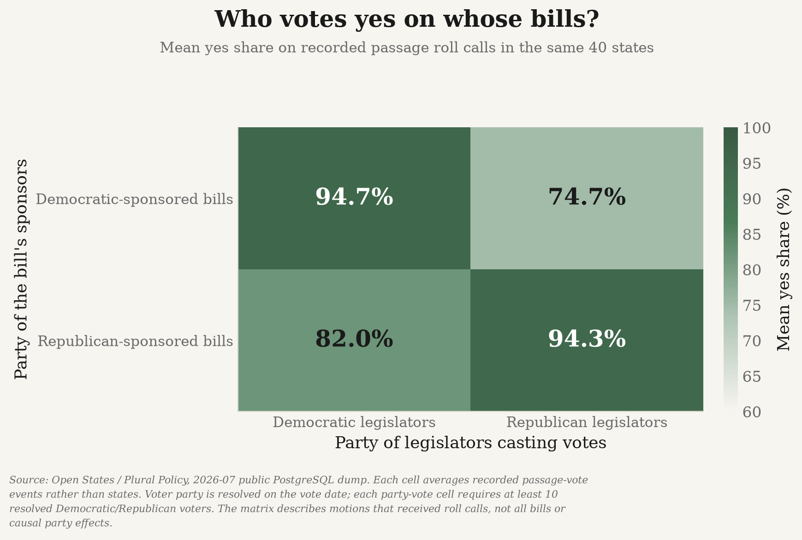
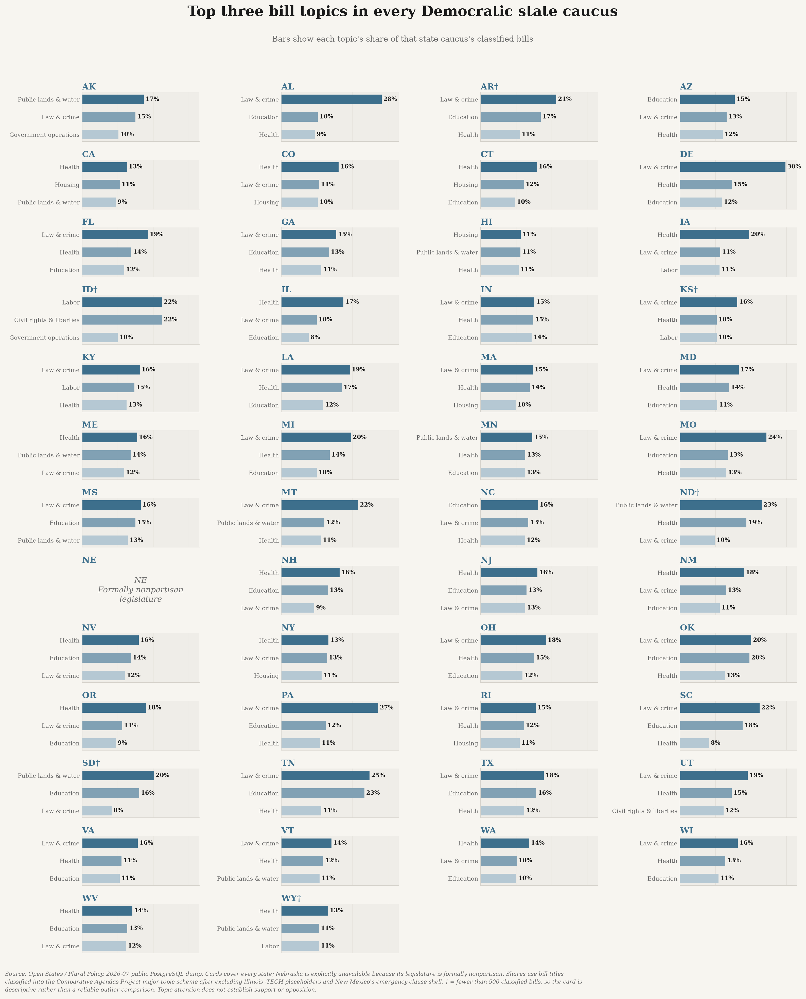
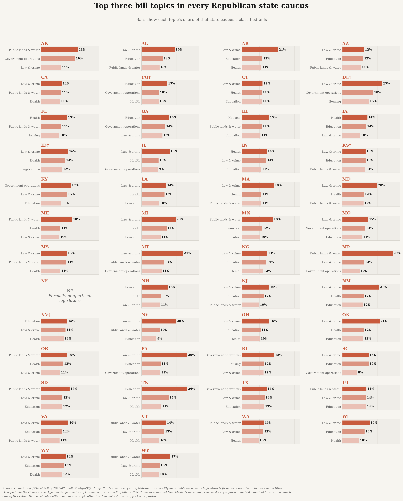
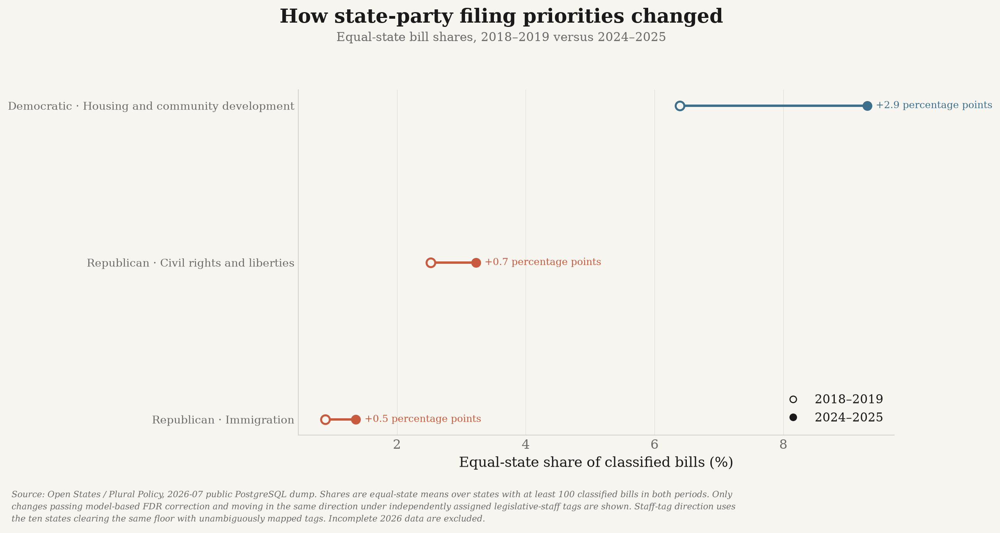

# state-politics

**What are the 50 state Democratic and Republican party organizations actually emphasizing?**

This project measures the policy priorities of all 100 U.S. state-level party organizations
(50 states × 2 parties) from two complementary evidence streams, classified into one shared
taxonomy so they can be compared directly.

| Stream | What it captures | Actor | Source |
|---|---|---|---|
| **A. Platforms** | *Stated* priorities — what the party organization says it wants | State party committee | Harvard Dataverse (1846–2017) + original collection (2018–present) |
| **B. State bills** | *Revealed* priorities — what the party's legislators actually file | Party caucus in the legislature | Open States / Plural Policy |

Congressional bills are **out of scope**. This is about *state* politics.

📄 **[Full methodology →](docs/METHODS.md)**  ·
📐 **[Analytical scope →](docs/ANALYSIS_DEPTH.md)**  ·
🔍 **[Reproducibility audit →](docs/REPRODUCIBILITY.md)**  ·
🧭 **[Code guide →](docs/CODE_GUIDE.md)**  ·
📋 **[Roadmap and lessons →](docs/PLAN.md)**  ·
📚 **[Citations →](CITATIONS.md)**

---

## Data

- **Stated priorities:** 687 confirmed party-committee documents in the modern collection:
  502 current documents (500 dated 2018+ and two currently published but undated) across 81
  organizations, plus 185 older fallback documents. A separately labelled four-source
  legislative-caucus supplement fills four otherwise missing state-party rows; it does not enter
  the platform-vs-bill headline.
- **Revealed priorities:** 1,087,327 state legislative bills and 5,000,761 sponsorship records.
- **Recorded outcomes:** 8,954,085 bill actions and 869,001 bill-linked vote events, with
  historical originating/action/vote chamber metadata.
- **Historical comparison:** 2,091 documents: state platforms from 49 states (1846–2017)
  plus U.S. national platforms beginning in 1840.
- **State profiles:** 100 state × party rows, with stated evidence where available and partisan
  bill evidence for every state except Nebraska's formally nonpartisan legislature.

Collection, missing-source verification, OCR reconstruction and coverage accounting are
documented in [Methods](docs/METHODS.md) and
[Reproducibility](docs/REPRODUCIBILITY.md).

---

## What the parties say

Every 2018-present platform, and every major-party platform from 1990 onward, is segmented
into planks and classified against a
[Comparative Agendas Project](https://www.comparativeagendas.net/) taxonomy using a validated
text classifier — 49,575 planks from 1,221 documents, with 43,971 classified.


Democratic platforms devote more space to labour, environment, health and social welfare;
Republican platforms to public lands, government operations, taxation, culture and family
questions, and law and crime.

---

## The headline result: what they say vs. what they file


**Both parties talk far more about rights and identity than they legislate, and legislate far
more about crime, transportation and education than they talk about.**

The national values are equal-state means over the same states represented for both parties in
both streams. Raw pooled-plank and pooled-bill results are retained as sensitivity artifacts, so
long platforms and high-volume legislatures cannot define a party average by themselves.

Every row was re-derived a second time using topic labels written by **legislative staff**
instead of by this project's model. That independent check uses the 24 states with both party
streams and mappable tags; its direction, not its level, is the comparison shown in the third
column.

| Topic | D said → filed | R said → filed | Replicates? |
|---|---|---|---|
| Civil rights and liberties | 11.1% → **4.4%** | 15.7% → **3.4%** | ✅ tags: 2.2% / 0.8% |
| Immigration | 6.6% → **0.9%** | 4.9% → **1.2%** | ✅ tags: 0.3% / 0.1% |
| Culture, family, social issues | 2.5% → **1.9%** | 4.9% → **1.9%** | ⚠ D reverses; R holds |
| Law, crime and justice | 10.2% → **14.6%** | 8.9% → **13.9%** | ✅ tags: 13.1% / 13.0% |
| Transportation | 2.0% → **3.6%** | 0.8% → **4.5%** | ✅ tags: 5.6% / 8.4% |
| Education | 8.3% → **11.9%** | 9.9% → **12.0%** | ✅ tags: 14.7% / 15.8% |
| Housing and community development | ~~3.6% → 7.6%~~ | 0.8% → **6.9%** | ❌ D reverses; R direction holds but tags show only 1.4% |

The topics that dominate platform rhetoric are largely *national* fights that state legislatures
have limited power over; the topics that dominate actual filing are the bread-and-butter business
of state government. Civil rights is the sharpest case: Republican state parties average 15.7%
of current platform attention there, versus 3.4% of classified filings.

**The Democratic housing row does not survive the check and should not be believed.** The classifier reads
a property-tax bill by the thing being taxed rather than by the tax, so "authorize a property tax
freeze for owner-occupied homes" lands in housing. The Republican direction holds under tags,
but its tag-based increase is far smaller than the model result. Rows marked † in the figure
fail for at least one party and should not be read as findings.

### How the claims were checked

Roughly half of all bills carry `subject` tags applied by the legislature's own staff — an
independent labelling that owes nothing to this project's model.
[181 unambiguous tags](conf/subject_topic_map.yml) are mapped onto the same taxonomy and used
both to score the classifier and to re-derive the headline outright.

| Check | Result |
|---|---|
| Plank classifier vs. hand-labelled gold set | 62% top-1, 78% top-2 |
| Bill-title classifier vs. statehouse tags | **63.2%** agreement on 46,657 bills, 35 states |
| Headline re-derived over one matched sample | **34 of 42 rows hold** across 24 states |

The consequential failure is taxation: Macroeconomics recall is 18.1%, so tax bills scatter
into whatever was being taxed — inflating housing and public lands. Several other failed rows
change sign by only a fraction of a point and should be treated as noise. Full precision/recall
breakdown is in [the methods](docs/METHODS.md#validating-the-bill-classifier).

**Other limits.** Bills are classified from *titles*, which are short and often procedural.
18.9% of bills have unknown sponsorship and another 6.3% are bipartisan; both are excluded
rather than forced into D or R. Planks
below a similarity threshold are recorded as **unclassified** rather than pushed into the nearest
topic — 5,604 of 49,575. And filing a bill is not passing one: this measures **agenda, not
achievement**.

---

## What happens after bills are filed?

The filing agenda is now linked to explicit Open States actions and roll calls rather than
assuming that introduction means success.



- Across the same 41 reliable states, **24.5% of Democratic-sponsored bills** and **28.7% of
  Republican-sponsored bills** reached passage in at least one chamber or a later recorded
  executive stage.
- Recorded enactment—`became-law`, executive signature, or successful veto override—is
  **14.6% for Democratic-sponsored bills** and **17.1% for Republican-sponsored bills**.
- Across 41 states where both parties clear the same 500-bill/80%-action-coverage floor, the
  D−R enactment gap is −2.5 percentage points and **not distinguishable from chance**
  (paired sign-flip p = .353).



- Across the same 40 roll-call states, same-party yes shares average **94.7% for Democrats**
  and **94.3% for Republicans**. Cross-party support is still substantial: Republican
  legislators average 74.7% yes on Democratic-sponsored bills, and Democrats 82.0% on
  Republican-sponsored bills.

These are descriptive sponsor-party associations, not causal party-performance estimates.
Majority control, bill mix, institutional rules and which motions receive roll calls all differ
by state. Person-level roll-call coverage reaches 49 states; Missouri has vote events but no
resolved person-vote rows in this dump.

---

## Do the parties hold together? Intra-party comparison

Every figure above treats each party as one actor. With 50 state organizations per party, that
assumption can be tested rather than assumed.

```bash
uv run python -m state_politics.analysis.intraparty
uv run python scripts/plot_intraparty.py
```


The party label provides only a modest similarity advantage. For platforms, same-party state
organizations are **76.6% similar** in topic mix versus **72.6%** for opposite-party pairs—a
4.0-point difference. For bills, the comparison is **89.7% versus 87.7%**, only 2.0 points.

**This measures agenda overlap, not agreement.** Every vector is a distribution over *topics*,
so two organizations are "close" when they devote similar attention to the same subjects — not
when they want the same things. A Democratic and a Republican platform that each spend 10% of
their planks on abortion are adjacent on this measure while advocating opposite policies. The
finding is about what parties put on the agenda, not about ideology.

Neither apparent party dispersion difference survives permutation testing. Republican platforms
are somewhat more scattered (0.260 vs 0.209, p = 0.114), while Democratic bill agendas are
somewhat more scattered (0.113 vs 0.093, p = 0.317). Both are null results rather than evidence
that one party is inherently more internally divided.

What state parties *do* disagree about differs by party:

| | Most divisive topics within the party (cross-state SD of topic share) |
|---|---|
| **Democratic platforms** | Public lands and water (6.2pp), Civil rights (4.8pp), Law and crime (4.8pp) |
| **Republican platforms** | Government operations (7.6pp), Civil rights (7.5pp), Public lands (7.5pp) |
| **Democratic bills** | Law and crime (5.7pp), Public lands (3.9pp), Education (3.7pp) |
| **Republican bills** | Law and crime (4.2pp), Public lands (4.1pp), Government operations (3.4pp) |

Public lands is the clearest case of geography beating party: it is a top-three source of
internal disagreement for both parties in both streams. A Nevada party of either stripe has a
public-lands agenda and a Rhode Island one does not.

Dispersion is only ever compared between parties over the **same set of states**, since a party
whose surviving platforms come from more unusual states would otherwise look more divided for
purely compositional reasons. That restriction is what limits the platform comparison to 24
states.

These are comparison samples, not data-coverage counts. The project has stated state-level
evidence for all 50 states, but this matched platform comparison requires **both parties in the
same state** to have at least 30 classified current planks, leaving 24 states. Bills cover all
50 states, but Nebraska has no D/R caucus comparison because its legislature is formally
nonpartisan, leaving 49.

---

## Which states stand out within their own party?

The national averages hide large state differences. `state_party_focus.csv` contains one row
for every state × party pair, comparing each state with **other states of the same party**.
The bill side covers 98 partisan caucuses across 49 states; Nebraska is explicitly unavailable
because its legislature is formally nonpartisan.

### All-state focus lookup

These two card atlases show **absolute topic attention** for every state, not just the largest
outliers. Each state card lists its three largest bill-topic shares.



[Open the full-resolution Democratic atlas](outputs/democratic_50_state_focus_cards.png)



[Open the full-resolution Republican atlas](outputs/republican_50_state_focus_cards.png)

A values-quadrant chart would imply ideological position—support versus opposition—that bill
topics alone do not contain. The cards therefore show what receives attention; the next chart
shows what is unusually emphasized relative to same-party peers.


Representative departures:

| State party | Disproportionate bill focus | State share | Same-party peers | Titles classified |
|---|---|---:|---:|---:|
| Hawaii Democrats | Environment | 6.4% | 2.4% | 81.2% |
| Minnesota Democrats | Public lands and water | 14.6% | 7.8% | 76.0% |
| Alaska Democrats | Public lands and water | 17.4% | 7.7% | 85.4% |
| North Dakota Republicans | Public lands and water | 28.8% | 11.0% | 86.5% |
| Alaska Republicans | Government operations | 19.3% | 8.8% | 81.2% |
| Hawaii Republicans | Housing and community development | 15.4% | 6.3% | 78.6% |

The baseline is leave-one-state-out, so a state never helps define the party average it is
measured against. Filed-focus rankings require 500 classified bills. The full atlas also includes
stated-agenda topics, evidence type, sample size, classification coverage, cosine distance and
distinctive language. Illinois `-TECH` shells and New Mexico's standard emergency-clause title
are excluded because they do not describe policy.

### How filing agendas changed

The longitudinal analysis gives each state equal weight and compares complete two-year windows
(2018–2019 versus 2024–2025).



- Democratic housing/community-development attention rose from **6.4% to 9.3%**, the largest
  robust shift (+2.9 percentage points).
- Republican civil-rights/liberties attention rose from **2.5% to 3.2%**.
- Republican immigration attention rose from **0.9% to 1.4%**.

Only changes that pass the paired-state/FDR test and move in the same direction under independent
legislative-staff tags are shown. Validation details and discarded model-only movements are in
[Methods](docs/METHODS.md#bill-topic-change-over-time). The partial 2026 year is excluded.

### Elections and voting

Election policy is hidden inside the broad Government Operations taxonomy, so it is measured
separately from titles covering voting, ballots, election administration, campaign finance,
redistricting, candidate rules and election security.


- Republican caucuses devote **3.43%** of substantive bills to elections and voting; Democrats
  **3.05%**.
- Tennessee Democrats are the strongest Democratic outlier among caucuses with at least 500
  substantive bills: **8.0%** versus 4.0% among Democratic peers.
- Nevada Republicans lead their side: **8.4%** versus 3.8% among Republican peers.
- The title rule scores **85.6% precision and 75.6% recall** against legislature-assigned
  subject tags.
- Most detected bills concern voting and election administration; campaign finance,
  redistricting, candidate rules and election security form smaller subgroups.

### Distinctive language: TF-IDF and log₂ concentration

`state_party_terms.csv` reports both TF-IDF and a same-party concentration score for words and
two-word phrases. A log₂ score of +1 means a term is twice as concentrated as in peer states;
+2 means four times. Examples:

| State party and stream | Distinctive language |
|---|---|
| Alaska Democrats, stated | `subsistence` (+10.9), `salmon` (+7.5) |
| Kentucky Republican caucus supplement (8 items; descriptive) | `postsecondary`, `sick leave` (absent in caucus peers) |
| New Jersey Republican caucus supplement (21 items; descriptive) | `school funding`, `property taxes` (absent in caucus peers) |
| South Dakota Democrats, stated | `initiated measure` (+9.2), `native language` (+7.7) |
| Alaska Democrats, bills | `permanent fund` (+12.0) |
| Arkansas Republicans, bills | `child maltreatment` (+7.2) |

These are exploratory language signals, not topic labels. A numeric value is reported only when
same-party peers also use the phrase; a phrase used by no peers is labelled `absent in peers`
rather than assigned an arbitrary pseudo-ratio. Legislative drafting conventions and proper
names can also become state-specific; the public highlights filter common procedural
boilerplate, while the raw scores remain available for inspection.

---

## Model legislation

Advocacy groups circulate template bills, and near-identical text surfacing in a dozen capitols
is visible in the data: **302 clusters spanning 3+ states, 3,480 bills, the widest reaching 19.**

| States | Bills | Cohesion | Template |
|---|---|---|---|
| 19 | 37 | 0.57 | Audiology and speech-language pathology interstate compact |
| 12 | 81 | 0.54 | Agreement Among the States to Elect the President by National Popular Vote |
| 9 | 18 | 0.62 | Uniform Civil Remedies for Unauthorized Disclosure of Intimate Images |
| 6 | 38 | 0.36 | Applying for an Article V convention to amend the U.S. Constitution |
| 6 | 26 | 0.50 | Forming Open and Robust University Minds (FORUM) Act |

This shows **text reuse, not coordination**, and the state counts are an upper bound — clusters
are connected components, so `cohesion` (the lowest pairwise similarity inside a cluster) is
reported alongside. Ceremonial resolutions circulate just as widely and are flagged separately
(98 of 302).

---

## Data sources

All fetched and verified live; full citations, crediting the *collecting* organizations, are in
[`CITATIONS.md`](CITATIONS.md).

| Source | Role | Scale |
|---|---|---|
| Hopkins, Coffey, Galvin, Gamm, Henderson, Paddock & Schickler — *Select American State Party Platforms* (Harvard Dataverse, CC0) | Historical platforms | 2,091 docs, 49 states, 1840–2017 |
| Open States / Plural Policy — bulk data | Bills, sponsors, actions, chambers and roll calls | 1,087,327 bills; 8,954,085 actions; 869,001 vote events; 50 states |
| Internet Archive + official document hosts | Discovery of current platforms/resolutions | 408 Wayback, 274 live, 5 official OCR-hosted copies |
| Official state legislative caucus sites | Separately labelled agenda supplement | 4 sources completing stated state-level coverage to 50/50 |
| Wikidata + hand verification | Registry of official party websites | 100/100 resolved |

---

## Core principles

1. **No fabricated or interpolated data.** Every document and bill traces to a fetched URL with an
   HTTP status, timestamp and SHA-256. If a party published nothing, that is **omitted** — never
   imputed, never smoothed.
2. **Absence is a finding.** Every gap carries a directly-probed reason. The gap report is a
   deliverable.
3. **Validate before interpreting.** Classifier results are checked against hand-labelled
   platform planks and independently assigned legislative subject tags.
4. **Cite the collector, not the redistributor.**
5. **Reproducible from source.** Nothing in `data/` is committed except the hand-labelled
   validation set, which is authored input rather than a derived artifact.

---

## Reproduce

Requires Python 3.11+ and [uv](https://docs.astral.sh/uv/).

```bash
make setup      # install dependencies
make all        # analysis + figures
make test lint audit  # tests, lint, traceability and published-number checks
```

Network-heavy stages are deliberately **not** part of `make all`, so rebuilding the analysis never
re-crawls anyone's website:

```bash
make registry     # verify all 100 state party websites          (~10 min)
make platforms    # discover + collect 2018-present platforms    (~1 h, polite crawl)
make official-documents  # deterministically rebuild OCR-only party documents
make caucus-priorities  # collect the four separate caucus agenda sources
make bills-dump   # download dump; extract bills/actions/votes; delete it (~25 min)
```

Every canonical number in this README can be reprinted from the artifacts:

```bash
uv run python scripts/report_figures.py
```

`make audit` verifies every manual-input hash, source registry, random seed, OCR version,
generated-artifact producer, 50-state coverage invariant, focus-atlas row, election
numerator/denominator, and log₂ calculation. It writes
`data/processed/reproducibility_report.json`.

---

## Layout

```
state-politics/
├── conf/                        # taxonomy, party registry, gap findings, tag map
├── data/gold/                   # hand-labelled validation set (authored input)
├── docs/                        # METHODS.md, PLAN.md
├── src/state_politics/
│   ├── provenance.py            # url, http_status, sha256, retrieved_at, source_org
│   ├── compute.py               # model runtime and reproducibility helpers
│   ├── platforms/               # stream A: collection + extraction
│   ├── bills/                   # stream B: Open States ingest + sponsor party join
│   ├── analysis/                # taxonomy, emphasis, divergence, diffusion, validation
│   └── plotting/                # shared portfolio chart theme
├── outputs/                     # figures
└── tests/
```

Every network fetch goes through `state_politics.provenance`, which writes an append-only JSONL
log of URL, HTTP status, SHA-256, byte count, content type, timestamp and collecting organization.
`fetch()` deliberately **does not raise** on HTTP errors — a 404 is a legitimate research finding,
recorded rather than thrown away.
