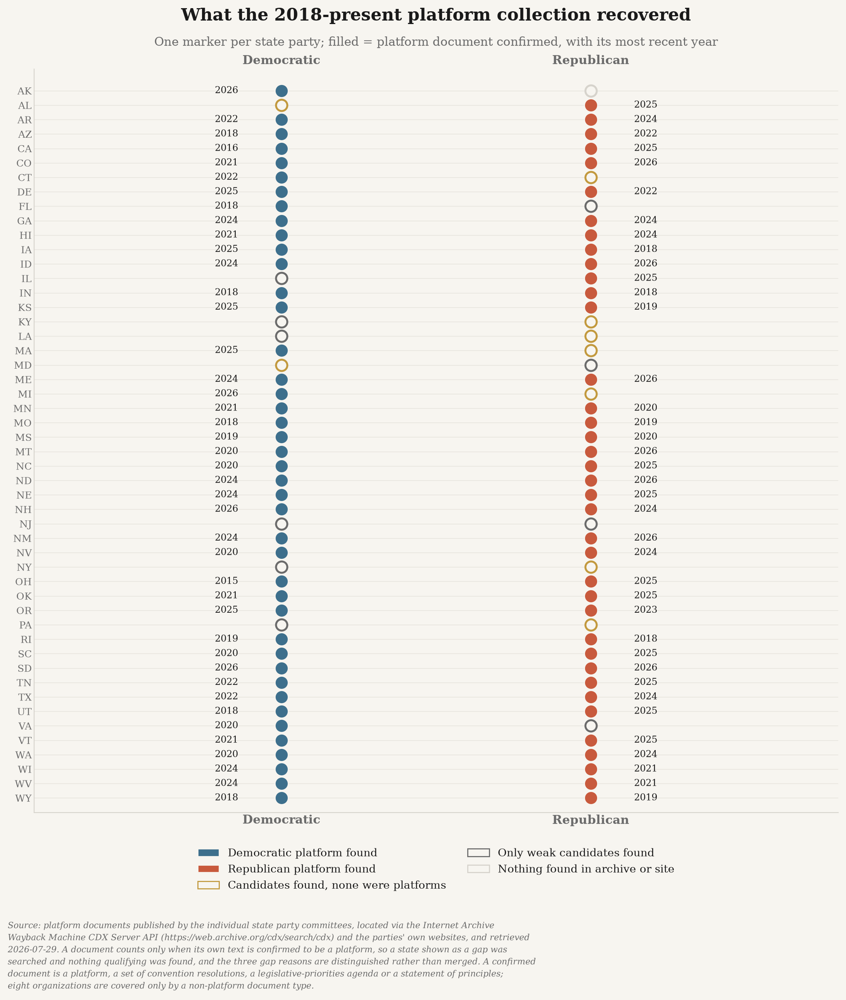
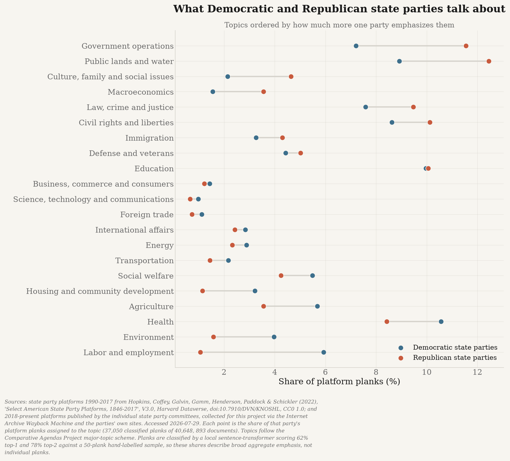
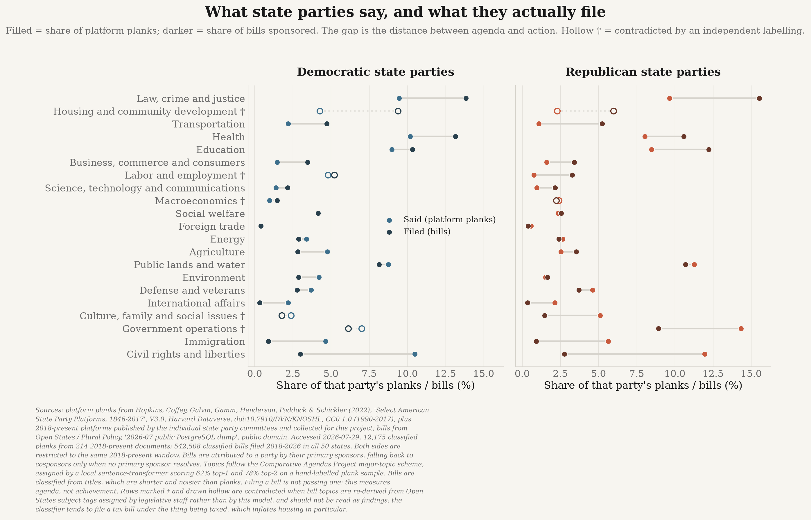
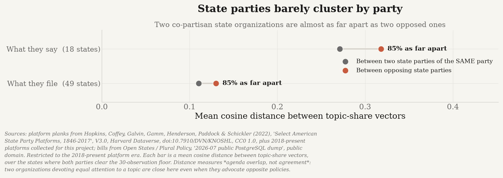

# state-politics

**What are the 50 state Democratic and Republican party organizations actually emphasizing?**

This project measures the policy priorities of all 100 U.S. state-level party organizations
(50 states × 2 parties) from two complementary evidence streams, classified into one shared
taxonomy so they can be compared directly.

| Stream | What it captures | Actor | Source |
|---|---|---|---|
| **A. Platforms** | *Stated* priorities — what the party organization says it wants | State party committee | Harvard Dataverse (1846–2017) + original collection (2018–present) |
| **B. State bills** | *Revealed* priorities — what the party's legislators actually file | Party caucus in the legislature | Open States / Plural Policy |

Congressional bills are **out of scope**. This is about *state* politics.

📄 **[Full methodology →](docs/METHODS.md)**  ·  📋 **[Roadmap and lessons →](docs/PLAN.md)**  ·  📚 **[Citations →](CITATIONS.md)**

---

## Why this project exists

The best existing platform corpus — *Select American State Party Platforms, 1846–2017*
(`doi:10.7910/DVN/KNOSHL`) — is excellent but **stops at 2017**, and its coverage is very uneven:
Maryland is absent entirely, Kentucky Democrats last appear in **1943**, New York Democrats in
**1958**.

**So the 2018–present platform corpus does not exist, and this project builds it** from official
state party websites and the Internet Archive — 244 documents covering 80 of 100 organizations
across 44 states.



The 20 organizations with no platform are a **finding, not a hole**: each was probed by hand and
carries a recorded reason in [`conf/platform_gaps.yml`](conf/platform_gaps.yml). Most simply
publish no platform; a few publish only a short blurb, one site is suspended, and one had
candidates that never confirmed.

That claim was stress-tested rather than assumed, in four independent ways:

| Method | Scope | Real platforms found |
|---|---|---|
| Every archived **PDF** ≥25 KB, no path filtering | 791 documents, all 21 gap domains + former domains | **1** (Delaware GOP's *Rescue Delaware Plan*, 2022 — now in the corpus) |
| Every archived **HTML page** ≥30 KB | ~500 pages, the 6 states with nothing at all | **0** |
| **Live probing of 36 candidate paths** (`/platform`, `/principles`, `/where-we-stand`, `/resolutions`, …) | 12 organizations | **0** |
| **Querying each site's own CMS index** (`wp-json`, Wix page manifest) | 12 organizations | **0** |

The near-misses are instructive: Louisiana Republicans' largest "platform" match was their
**privacy policy**, and Kentucky Republicans' was a 453-word *About* page. **Six states — Kentucky,
Louisiana, Maryland, New Jersey, New York and Pennsylvania — have no state platform from either
party.** These are large states, and the absence is the finding: their committees campaign on
candidates and national platforms rather than publishing a state programme.

---

## What the parties say

Every 2018-present platform, and every major-party platform from 1990 onward, is segmented
into planks and classified against a
[Comparative Agendas Project](https://www.comparativeagendas.net/) taxonomy by a
sentence-transformer running **locally on Apple Silicon** — 40,648 planks from 893 documents.



Democratic platforms devote more space to labour, environment, health and social welfare;
Republican platforms to public lands, government operations, taxation, culture and family
questions, and law and crime.

---

## The headline result: what they say vs. what they file



**Both parties talk far more about rights and identity than they legislate, and legislate far
more about crime, transportation and education than they talk about.**

Every row was re-derived a second time using topic labels written by **legislative staff**
instead of by this project's model. That independent check is the third column.

| Topic | D said → filed | R said → filed | Replicates? |
|---|---|---|---|
| Civil rights and liberties | 10.5% → **3.0%** | 12.0% → **2.8%** | ✅ gap is *larger* (1.5% / 0.7%) |
| Immigration | 4.7% → **0.9%** | 5.6% → **0.9%** | ✅ gap is *larger* (0.3% / 0.2%) |
| Culture, family, social issues | 2.4% → **1.8%** | 5.1% → **1.5%** | ✅ R only (2.6% / 2.4%) |
| Law, crime and justice | 9.5% → **13.8%** | 9.6% → **15.5%** | ✅ (13.8% / 13.5%) |
| Transportation | 2.2% → **4.7%** | 1.1% → **5.2%** | ✅ gap is *larger* (7.0% / 9.7%) |
| Education | 9.0% → **10.3%** | 8.5% → **12.2%** | ✅ gap is *larger* (14.3% / 19.5%) |
| ~~Housing and community development~~ | ~~4.3% → 9.4%~~ | ~~2.3% → 6.0%~~ | ❌ **does not replicate** (3.0% / 0.9%) |

The topics that dominate platform rhetoric are largely *national* fights that state legislatures
have limited power over; the topics that dominate actual filing are the bread-and-butter business
of state government. Immigration is the sharpest case — Republican platforms give it 5.6% of
their planks and Republican legislators 0.9% of their bills.

**The housing row does not survive the check and should not be believed.** The classifier reads
a property-tax bill by the thing being taxed rather than by the tax, so "authorize a property tax
freeze for owner-occupied homes" lands in housing. It is struck through rather than quietly
deleted, because a corrected claim is more useful than a tidy one. Rows marked † in the figure
are flagged for the same reason.

### How the claims were checked

Roughly half of all bills carry `subject` tags applied by the legislature's own staff — an
independent labelling that owes nothing to this project's model.
[181 unambiguous tags](conf/subject_topic_map.yml) are mapped onto the same taxonomy and used
both to score the classifier and to re-derive the headline outright.

| Check | Result |
|---|---|
| Plank classifier vs. hand-labelled gold set | 62% top-1, 78% top-2 |
| Bill-title classifier vs. statehouse tags | **63.2%** agreement on 46,659 bills, 35 states |
| Headline re-derived from tags, not the model | **34 of 40 rows hold** (111,521 bills) |

The seven failures share one cause: Macroeconomics recall is 18.1%, so tax bills scatter into
whatever was being taxed — inflating housing and public lands. Full precision/recall breakdown
in [the methods](docs/METHODS.md#validating-the-bill-classifier).

**Other limits.** Bills are classified from *titles*, which are short and often procedural.
18.9% of bills cannot be resolved to a party and are excluded rather than guessed at. Planks
below a similarity threshold are recorded as **unclassified** rather than pushed into the nearest
topic — 3,598 of 40,648. And filing a bill is not passing one: this measures **agenda, not
achievement**.

---

## Do the parties hold together? Intra-party comparison

Every figure above treats each party as one actor. With 50 state organizations per party, that
assumption can be tested rather than assumed.

```bash
uv run python -m state_politics.analysis.intraparty
uv run python scripts/plot_intraparty.py
```



**Two co-partisan state organizations are about 85% as far apart as two opposed ones** — 0.85 in
what they say, 0.85 in what they file. The two streams are independent (different authors,
different sources, different years), and they agree. On topic emphasis, the party label carries
surprisingly little information about how alike two state organizations are.

**This measures agenda overlap, not agreement.** Every vector is a distribution over *topics*,
so two organizations are "close" when they devote similar attention to the same subjects — not
when they want the same things. A Democratic and a Republican platform that each spend 10% of
their planks on abortion are adjacent on this measure while advocating opposite policies. The
finding is about what parties put on the agenda, not about ideology.

**Republican state parties disagree with each other more than Democratic ones do — but only in
what they say.** Republican platforms are markedly more scattered (mean pairwise distance 0.319
vs 0.223), and a permutation test that shuffles the party labels across the same 18 states puts
that outside chance (p = 0.026). The same comparison on bills runs the other way and is *not*
significant (0.121 vs 0.100, p = 0.30), so it is reported as a null result.

That contrast is the interesting part: Republican state committees write more varied platforms
than Democratic ones, while their legislators file strikingly similar bills.

What state parties *do* disagree about differs by party:

| | Most divisive topics within the party (cross-state SD of topic share) |
|---|---|
| **Democratic platforms** | Public lands and water (7.1pp), Agriculture (4.9pp), Law and crime (4.8pp) |
| **Republican platforms** | Government operations (10.3pp), Public lands (8.1pp), Civil rights (8.1pp) |
| **Democratic bills** | Law and crime (5.7pp), Public lands (4.0pp), Education (3.8pp) |
| **Republican bills** | Public lands (4.2pp), Law and crime (4.1pp), Government operations (3.5pp) |

Public lands is the clearest case of geography beating party: it is a top-three source of
internal disagreement for **both** parties in **both** streams, because a Nevada party of either
stripe has a public-lands agenda and a Rhode Island one does not.

Dispersion is only ever compared between parties over the **same set of states**, since a party
whose surviving platforms come from more unusual states would otherwise look more divided for
purely compositional reasons. That restriction is what limits the platform comparison to 18
states.

---

## Model legislation

Advocacy groups circulate template bills, and near-identical text surfacing in a dozen capitols
is visible in the data: **187 clusters spanning 3+ states, 2,027 bills, the widest reaching 19.**

| States | Bills | Cohesion | Template |
|---|---|---|---|
| 19 | 37 | 0.57 | Audiology and speech-language pathology interstate compact |
| 12 | 81 | 0.54 | Agreement Among the States to Elect the President by National Popular Vote |
| 9 | 18 | 0.62 | Uniform Civil Remedies for Unauthorized Disclosure of Intimate Images |
| 6 | 38 | 0.36 | Applying for an Article V convention to amend the U.S. Constitution |
| 6 | 26 | 0.50 | Forming Open and Robust University Minds (FORUM) Act |

This shows **text reuse, not coordination**, and the state counts are an upper bound — clusters
are connected components, so `cohesion` (the lowest pairwise similarity inside a cluster) is
reported alongside. Ceremonial resolutions circulate just as widely and are flagged separately
(65 of 187).

---

## Data sources

All fetched and verified live; full citations, crediting the *collecting* organizations, are in
[`CITATIONS.md`](CITATIONS.md).

| Source | Role | Scale |
|---|---|---|
| Hopkins, Coffey, Galvin, Gamm, Henderson, Paddock & Schickler — *Select American State Party Platforms* (Harvard Dataverse, CC0) | Historical platforms | 2,091 docs, 49 states, 1840–2017 |
| Open States / Plural Policy — bulk data | Bills, sponsors, legislators | 1,087,327 bills, 50 states, sessions overlapping 2018–2026 |
| Internet Archive — Wayback CDX API | Discovery of 2018–present platforms | 236 of 244 docs recovered |
| Wikidata + hand verification | Registry of official party websites | 100/100 resolved |

---

## Core principles

1. **No fabricated or interpolated data.** Every document and bill traces to a fetched URL with an
   HTTP status, timestamp and SHA-256. If a party published nothing, that is **omitted** — never
   imputed, never smoothed.
2. **Absence is a finding.** Every gap carries a directly-probed reason. The gap report is a
   deliverable.
3. **No hosted LLM APIs — models run locally.** Enforced in code: a test scans the source tree for
   hosted-provider imports and fails the build. A hosted model is an unversioned dependency, and a
   result that cannot be regenerated from pinned local weights is not reproducible.
4. **Cite the collector, not the redistributor.**
5. **Reproducible from source.** Nothing in `data/` is committed except the hand-labelled
   validation set, which is authored input rather than a derived artifact.

---

## Reproduce

Requires Python 3.11+ and [uv](https://docs.astral.sh/uv/). Apple Silicon is used for local GPU
inference, with a CPU fallback.

```bash
make setup      # install dependencies, including the local model stack
make all        # analysis + figures
make test lint  # 322 tests, ruff
```

Network-heavy stages are deliberately **not** part of `make all`, so rebuilding the analysis never
re-crawls anyone's website:

```bash
make registry     # verify all 100 state party websites          (~10 min)
make platforms    # discover + collect 2018-present platforms    (~1 h, polite crawl)
make bills-dump   # download the 10.7 GB dump, extract, delete it (~20 min)
```

Every canonical number in this README can be reprinted from the artifacts:

```bash
uv run python scripts/report_figures.py
```

---

## Layout

```
state-politics/
├── conf/                        # taxonomy, party registry, gap findings, tag map
├── data/gold/                   # hand-labelled validation set (authored input)
├── docs/                        # METHODS.md, PLAN.md
├── src/state_politics/
│   ├── provenance.py            # url, http_status, sha256, retrieved_at, source_org
│   ├── compute.py               # local device selection + hosted-LLM guard
│   ├── platforms/               # stream A: collection + extraction
│   ├── bills/                   # stream B: Open States ingest + sponsor party join
│   ├── analysis/                # taxonomy, emphasis, divergence, diffusion, validation
│   └── plotting/                # shared portfolio chart theme
├── outputs/                     # figures
└── tests/
```

Every network fetch goes through `state_politics.provenance`, which writes an append-only JSONL
log of URL, HTTP status, SHA-256, byte count, content type, timestamp and collecting organization.
`fetch()` deliberately **does not raise** on HTTP errors — a 404 is a legitimate research finding,
recorded rather than thrown away.
